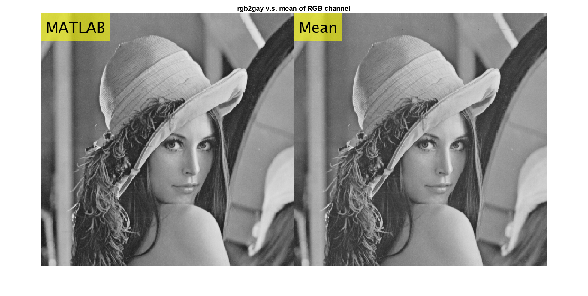
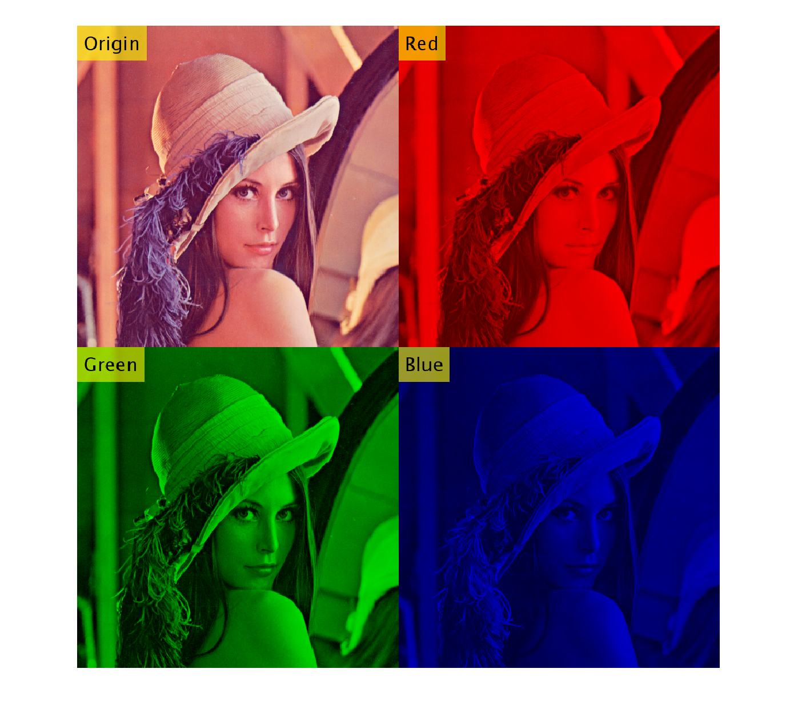

# Image-Processing
Description
---
NTNU CSIE Image Process ( CSU0041)
紀錄影像處理課程學習內容

Program : MATLAB
---
Dataset and Folder structure
---
```
Root/
├──DIP
│    │
│    ├── HW{number} 
│    │    └── result ...
│    │    
│    ├── lena_std.tiff                # standard input image
│    ├── main_HW1.m     
│    │    ...
│    └──  main_HW5.m   
└──README.md
```
NTNU CSIE Image Process ( CSU0041)
---
If you want to demo this program, please insure you have matlab and open to directory DIP/
and run main_HW{number}.

<!--  -->

<!-- replace  with  -->

### HW 1 Channel Extract



### HW 2 Dithering


### HW 3 Floyd Steinberg Method


### HW 4 Histogram Equalization


 
### HW 5


 
### HW 6 Resolution


### HW 10 Otsu's threshold method


